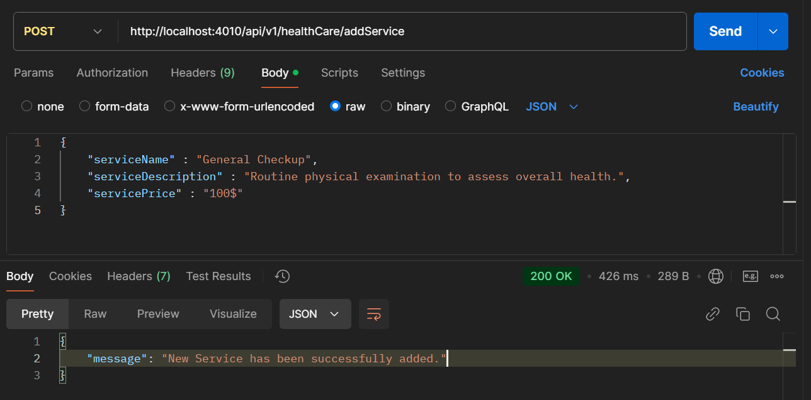

# Health Care Service

# Overview

- This is a simple Health Care Services API that allows users to manage healthcare data.
- Users can add new healthcare services, including service name, description, and price.
- Users can update existing healthcare service details.
- Users can delete healthcare service records.
- The API also allows users to fetch and view all available healthcare services data from the database.
- Data management is streamlined with CRUD (Create, Read, Update, Delete) operations.
- The API is designed to ensure data integrity and provide easy access for healthcare-related data management.

# Set up and Installation

```
"dependencies": {
    "dotenv": "^16.4.5",
    "express": "^4.21.1",
    "mongoose": "^8.8.1"
  }
```

- **dotenv**: This package is used for loading environment variables from a `.env` file into `process.env` in a Node.js application. It helps manage sensitive information like API keys, database URIs, and other configuration values securely without hardcoding them into the application code.

- **express**: Express is a fast, unopinionated, minimalist web framework for Node.js. It is used for building web applications and APIs. Express provides a robust set of features to develop web and mobile applications, such as routing, middleware support, and template rendering.

- **mongoose**: Mongoose is an Object Data Modeling (ODM) library for MongoDB and Node.js. It manages relationships between data, provides schema validation, and offers a straightforward query API for interacting with MongoDB. Mongoose is particularly useful for defining models and handling database operations in a structured manner.

### Establishing Data Base Connection

- Before we start the server, we've to connect our db.

```
const mongoose = require("mongoose");

const connectDB = async () => {
  const dbURI = process.env.dbURI;
  try {
    await mongoose.connect(dbURI);
    console.log("Database connected");
    return mongoose.connection.db; // Return the database connection
  } catch (error) {
    console.error("Database connection error:", error);
    throw error;
  }
};

module.exports = connectDB;

```

### Start the server

After establishing the connection to our database then we can start our server.

```
const startServer = async () => {
  const PORT = process.env.PORT;
  try {
    const db = await connectDB();
    app.use("/api/v1/healthCare", healthServiceRouter());
    app.listen(PORT, () => console.log(`server is running on port ${PORT}`));
  } catch (err) {
    console.log(err);
    return res.status(500).json({ message: "Internal Server Error" });
  }
};

startServer();
```

# API Usage

## Endpoints

### 1) Add Health Care Service

**Endpoint**: `/api/v1/addService`

**Request Method** : `POST`

**Description**:

- This endpoint allows users to add new healthcare services to the database. Users can specify details such as the service name, a description of the service, and its price. Once posted, the data is stored for further operations like updating, fetching, or deleting services. This feature enables easy management and tracking of healthcare offerings within the system.

**Request Body** :

```

 {
 "serviceName" : "General Checkup",
 "serviceDescription" : "Routine physical examination to assess overall health.",
 "servicePrice" : "100$"
 }

```

**Example Request**


**Expected Response**

- **Status**: 200 OK

- **Description**: New Service has been successfully added..

- **Response Body**:

```
    {
        "message": "New Service has been successfully added."
    }
```



### 2) Get All Available Health Care Services

**Endpoint**: `/api/v1/getAllServices`

**Request Method** : `GET`

**Description**:

- This endpoint retrieves all available healthcare services stored in the database. It provides users with an overview of all services, including their names, descriptions, and prices. Only services that are marked as available will be returned. This feature is useful for users who need to browse, review, or select from the offered healthcare services.

**Example Request**


**Expected Response**

- **Status**: 200 OK

- **Response Body**:

       ```
          [
              {
                  "_id": "6736e8d0420ff10acf48f5de",
                  "serviceName": "General Checkup",
                  "serviceDescription": "Routine physical examination to assess overall health.",
                  "servicePrice": "100$",
                  "isAvailable": true,
                  "__v": 0
              }
          ]
       ```

  

### 3) Update Health Care Services

**Endpoint**: `/api/v1/updateService`

**Request Method** : `PUT`

**Description**:

- This endpoint allows users to update the details of an existing healthcare service. The request must include the unique service ID to identify which service should be modified. Additionally, it accepts fields that the user wants to update, such as the service name, description, or price. Upon successful completion of the update, a success message is returned, confirming that the service data has been modified. This feature ensures that healthcare service information remains current and accurate.

**Example Request**


- **Request Body**

  ```
  {
  "serviceName" : "General Checkup Health Care",
  "serviceDescription" : "Routine physical examination to assess overall health.",
  "servicePrice" : "100$",
  "serviceId" : "6736e8d0420ff10acf48f5de"
  }

  ```

**Expected Response**

- **Status**: 200 OK

- **Response Body**:

       ```
        {
      "message": "General Checkup Health Care has been successfully updated."
      }
       ```

  
