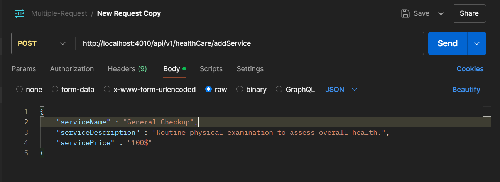

# Health Care Service

# Overview
- This is a simple Health care services API. User can add health care data such as service Name, service description, service price.
- and user can update the health care data, delete the data.
- User can also get all the available data from the database.


# Set up and Installation

```
"dependencies": {
    "dotenv": "^16.4.5",
    "express": "^4.21.1",
    "mongoose": "^8.8.1"
  }
```

- **dotenv**: This package is used for loading environment variables from a `.env` file into `process.env` in a Node.js application. It helps manage sensitive information like API keys, database URIs, and other configuration values securely without hardcoding them into the application code.

- **express**: Express is a fast, unopinionated, minimalist web framework for Node.js. It is used for building web applications and APIs. Express provides a robust set of features to develop web and mobile applications, such as routing, middleware support, and template rendering.

- **mongoose**: Mongoose is an Object Data Modeling (ODM) library for MongoDB and Node.js. It manages relationships between data, provides schema validation, and offers a straightforward query API for interacting with MongoDB. Mongoose is particularly useful for defining models and handling database operations in a structured manner.


### Establishing Data Base Connection
- Before we start the server, we've to connect our db.

```
const mongoose = require("mongoose");

const connectDB = async () => {
  const dbURI = process.env.dbURI;
  try {
    await mongoose.connect(dbURI);
    console.log("Database connected");
    return mongoose.connection.db; // Return the database connection
  } catch (error) {
    console.error("Database connection error:", error);
    throw error;
  }
};

module.exports = connectDB;

```

### Start the server ###
  
After establishing the connection to our database then we can start our server.

```
const startServer = async () => {
  const PORT = process.env.PORT;
  try {
    const db = await connectDB();
    app.use("/api/v1/healthCare", healthServiceRouter());
    app.listen(PORT, () => console.log(`server is running on port ${PORT}`));
  } catch (err) {
    console.log(err);
    return res.status(500).json({ message: "Internal Server Error" });
  }
};

startServer();
```

# API Usage

## Add Health care Serive

**Endpoint**: `/api/v1/addService`

**Request Method** : ```POST```

**Description**: 
  Accepts a task request for a specific user, adding it to the task queue if it meets rate limits and other processing requirements.
  
**Request Body** :

   ```
    
    {
    "serviceName" : "General Checkup",
    "serviceDescription" : "Routine physical examination to assess overall health.",
    "servicePrice" : "100$"
    }
    
   ```
    
**Example Request**




**Expected Response**

 - **Success Response**

**Status**: 200 OK

**Description**: Task successfully added to the queue and processed.

**Response Body**:

```
{
    "message": "New Service has been successfully added."
}
```


  
    
    


       
  


